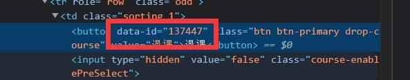

# USTC 选课脚本

看别人的脚本，补充代码(x)</br>
自己梭哈一个拖拉机版选课脚本(✔)


### 使用方法
前置条件:node环境

1. 下载脚本
2. 补充config.json
```
"SVRNAME":"student4",
"SESSION":"1db6d061-e346-49c0-a08b-d3645ef4cc17",
```
其中“SEVERNAME”和“SESSION“可在cookies获取(开发者模式->application->cookies)</br>

3. 在index.js中添加课程id
   ```javascript
   const courseIDList = [137509,137507];
   ```
   课程id获取方法:</br>
   进入开发者模式，选择想要选择的课程的“选课”按钮，其中data-id即为课程的id，如下图所示
   
4. 运行命令
   ```shell
   npm run start
   ```